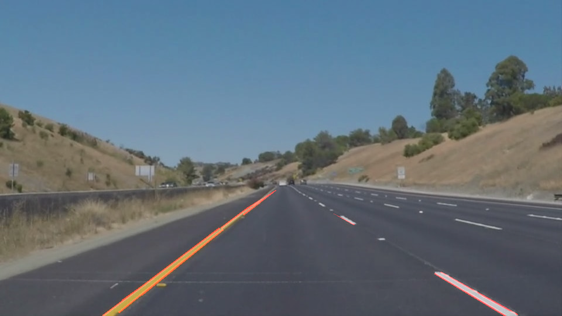

# Project 1: Finding Lane Lines on the Road #
## Reflection ##
### 1. Describe your pipeline. As part of the description, explain how you modified the draw_lines() function.

The project consists of modifications to two very similar functions.  The first, `test_pipeline`, runs a still image through a lane detection pipeline and saves the results.  The purpose of implementing this function is to test the effects of adjusting the numerous parameters to the pipeline algorithms.  Analysis of the effects of these parameters is qualitative, no accuracy heuristic is applied.  The pipeline begins by applying a grayscale transform and then applies the following algorithms:
1. **Gaussian filter** applies local averaging to flatten noisy gradients.  This improves performance of next algorithm.  The parameter `kernel_size` is the only tunable setting.
2. **Canny Edge Detection** identifies edge pixels in areas of the image with a steep brightness gradient.  The relevant parameters are `low_threshold` and `high_threshold`.
3. **Hough Transform** identifies lines of edge pixels in the image.  The relevant parameters are `rho`, `theta`, `threshold`, `min_line_len`, and `max_line_gap`.
4. **Region Masking** retains only pixels in a polygonal region.  The relevant parameter is `vertices`.

The Udacity module quizzes provide a baseline selection of parameters:
- `kernel_size`=5
- `low_threshold`=50
- `high_threshold`=150
- `threshold`=15
- `min_line_len`=40
- `max_line_gap`=20

The default Udacity parameters provided reasonable results and I noticed no substantial improvement by deviating from them.  Instead, I found improvements in performance (admittedly qualitative) by adjusting the polygon mask.  Because the road surface in the foreground of each sample picture is a uniform, I find a mask that extends just past the expected location of the lane lines provides good performance.  Masking distant portions of the road removed an often noisy region:

<figure>
 
 <figcaption>
 

 
 
 Noisy region on distant road surface 
 
 </figcaption>
</figure>
<figure>
 
 <figcaption>
 

 
 
 Distant region masked leaves good road surface indication 
 
 </figcaption>
</figure>

The second function I modified,`draw_lines`, takes as input the set of lines produced by the Hough Transformation and draws on the original image a pair of lines estimating the right and left lane line.  My implementation of `draw_lines` relies on three ideas:
* Left and right lane lanes can be expected to only occur in certain regions of the image.  Left and right regions can be treated separately.  Regions are `matplotlib.Path` objects.  A Hough transformation line is determined to fall in the region if it's first point returns true and the first point of each line is tested with the `matplotlib.Path`s `contains_point` function 
* The slopes of lane line estimates can be expected to fall within a certain range.  This range of slopes is mirrored for the left and right lanes.
* The line representing the estimated location of the lane lines is an average of lines that meet the above two criteria.  Further, longer Hough lines are probably better indicators of lane location, often occurring in the foreground at higher resolution, so the average is weighted by the squared norm of input lines.  

### 2. Identify potential shortcomings with your current pipeline

A difficulty of testing this pipeline is the number of parameters and possible range of acceptable values makes hand optimizing tedious.  There is likely parameter combinations that would produce better results without changing any of the architecture of the pipeline.

A second weakness is the running time of the pipeline.  In the domain of real-time autonomous vehicle lane detection, running time translates directly to the vehicle's reaction time.  The pipeline inefficiently processes all prtions of the image even though only portions are expected to contain lane line.  This is a substantially large amount of overhead.

A final weakness, in the context of processing streaming (or video) data, is that each input ignores the results of the previous.  In reality, a vehicle can be expected to maintain some proximity to the lane position calculated in the previous frame and the results of the previous frames should inform future estimations.

### 3. Suggest possible improvements to your pipeline

The first issue of tedious hand tuning can be addressed by defining a score function and automating the tuning of parameters.

The second weakness could be addressed by pre-processing the input to remove any regions unlikely to contain lane lines.

The final weakness could be addressed by incorporating previous lane detection results into the output of the pipeline.  A result could be used as input to a time domain averaging of previous results.
